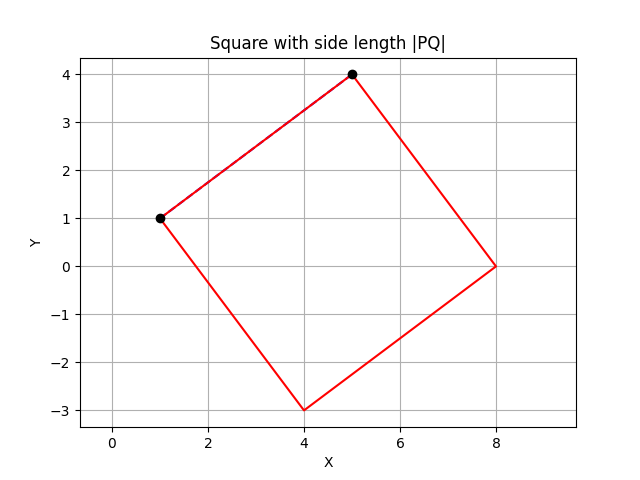

# IntroductionToComputerScience
Basics of Computer Science - Generated with help from ChatGPT

## 1. Operator Precedence

Understanding operator precedence is crucial in programming as it determines the order in which operations are evaluated in an expression. Let's delve deeper into this topic.

### Explanation:

Python follows the PEMDAS rule to determine operator precedence:

1. Parentheses `()`
2. Exponents `**`
3. Multiplication and Division `*`, `/`, `//`, `%` (evaluated left to right)
4. Addition and Subtraction `+`, `-` (evaluated left to right)

Operators with higher precedence are evaluated before those with lower precedence. If operators have the same precedence, they are evaluated from left to right.

### Example:

Consider the expression: `2 + 3 * 4 / 2`

To evaluate this expression correctly, we follow the operator precedence:

1. `3 * 4` equals `12`
2. `12 / 2` equals `6`
3. `2 + 6` equals `8`

So, the result of `2 + 3 * 4 / 2` is `8`.

### Multiple Choice Question:

What is the result of `5 * 3 + 2 ** 2 - 9 / 3`?

a) 5 \
b) 10 \
c) 17 \
d) 16 (Correct)

Explanation: Following operator precedence, first, `2 ** 2` is evaluated which results in `4`. Then `9 / 3` is evaluated as `3`. After that, multiplication and division are performed from left to right, followed by addition and subtraction. Hence, the result is `16`.

### Practice Problems:

1. Evaluate the expression: `(10 - 2) * 5 / 3 + 8`\
    21.33
2. Write a Python function that takes an arithmetic expression as input and returns the result after evaluating it according to operator precedence.

Feel free to attempt the practice problems and ask for solutions or further explanation!


## 2. Python Basics Review

Before diving into more advanced concepts, let's review some fundamental aspects of Python programming.

### Explanation:

Python is a versatile and powerful programming language known for its simplicity and readability. Here are some key basics:

1. **Variables and Data Types**: Variables are used to store data. Python supports various data types including integers, floats, strings, booleans, lists, tuples, sets, and dictionaries.

2. **Conditional Statements**: Conditional statements like `if`, `else`, and `elif` allow you to make decisions in your code based on certain conditions.

3. **Loops**: Loops such as `while` and `for` enable you to execute a block of code repeatedly.

4. **Functions**: Functions are blocks of reusable code that perform a specific task. They help in modularizing your code and making it more organized.

### Examples:

```python
# Variables and Data Types
x = 5  # integer
y = 3.14  # float
name = "Alice"  # string
is_student = True  # boolean

# Conditional Statements
if x > 0:
    print("x is positive")
elif x == 0:
    print("x is zero")
else:
    print("x is negative")

# Loops
while x > 0:
    print(x)
    x -= 1

for i in range(5):
    print(i)

# Functions
def greet(name):
    print("Hello, " + name + "!")

greet("Bob")
```

### Multiple Choice Question:

What will be the output of the following code snippet?

```python
x = 10
if x > 5:
    print("x is greater than 5")
elif x == 5:
    print("x is equal to 5")
else:
    print("x is less than 5")
```

a) x is greater than 5 (Correct) \
b) x is equal to 5 \
c) x is less than 5 \
d) Nothing will be printed

Explanation: Since the value of `x` is `10`, the condition `x > 5` is `True`, and the corresponding print statement is executed.

### Practice Problems:

1. Write a Python program to find the largest among three numbers entered by the user.
2. Implement a function called `is_prime` that takes an integer as input and returns `True` if it's a prime number, otherwise `False`.

Feel free to tackle the practice problems and ask for solutions or further explanation!


## 3. Conditional Statements (if/else/elif)

Conditional statements are fundamental constructs in programming that allow you to control the flow of your code based on certain conditions. In Python, `if`, `else`, and `elif` are used for this purpose. These statements enable your program to make decisions dynamically, executing different blocks of code depending on whether specific conditions are met or not.

### Detailed Instructions:

1. **if Statement**: The `if` statement is used to execute a block of code only if a specified condition evaluates to `True`. If the condition is `False`, the block of code inside the `if` statement is skipped.

   ```python
   x = 10
   if x > 5:
       print("x is greater than 5")
   ```

   In this example, the print statement will be executed because the condition `x > 5` is `True`.

2. **else Statement**: The `else` statement follows an `if` statement and executes a block of code if the `if` condition is `False`.

   ```python
   x = 3
   if x > 5:
       print("x is greater than 5")
   else:
       print("x is not greater than 5")
   ```

   Since `x` is `3` (which is not greater than `5`), the `else` block will be executed, printing "x is not greater than 5".

3. **elif Statement**: The `elif` statement allows you to check multiple conditions. It stands for "else if" and is used when you have more than two possible outcomes. You can have multiple `elif` statements after an `if` statement.

   ```python
   x = 5
   if x > 5:
       print("x is greater than 5")
   elif x == 5:
       print("x is equal to 5")
   else:
       print("x is less than 5")
   ```

   In this case, since `x` is equal to `5`, the `elif` block will be executed, printing "x is equal to 5".

### Explanation:

Conditional statements are crucial for controlling the flow of your program. They allow your code to make decisions dynamically based on the values of variables or other conditions. By using `if`, `else`, and `elif` statements, you can create complex decision-making structures that make your programs more flexible and powerful.

### Example:

Let's consider a scenario where we want to determine if a given number is positive, negative, or zero:

```python
num = int(input("Enter a number: "))

if num > 0:
    print("The number is positive")
elif num == 0:
    print("The number is zero")
else:
    print("The number is negative")
```

This code prompts the user to enter a number and then checks if it's positive, negative, or zero using conditional statements.

### Practice Problem:

Write a Python program that takes an integer as input and prints whether it's even or odd using conditional statements.

### Additional Note:

Conditional statements are powerful tools for controlling the flow of your program. They allow you to write code that can adapt to different situations, making your programs more robust and versatile. Mastering conditional statements is essential for becoming proficient in programming.


## 4. Loops (While / For)

Let's dive into loops, covering both the `while` and `for` loops, with clear explanations and practical examples.

### Explanation:

Loops are essential constructs in programming that allow you to execute a block of code repeatedly. They help in automating repetitive tasks and iterating over collections of data. In Python, there are two main types of loops: `while` and `for`.

1. **While Loop**: The `while` loop executes a block of code as long as a specified condition is `True`. It continues iterating until the condition becomes `False`.

2. **For Loop**: The `for` loop iterates over a sequence (such as a list, tuple, string, or range) and executes the block of code for each element in the sequence.

### Detailed Instructions:

1. **While Loop**:
   - In a `while` loop, the condition is checked before executing the block of code. If the condition is `True`, the block of code is executed, and then the condition is checked again. This process continues until the condition becomes `False`.

   ```python
   i = 1
   while i <= 5:
       print(i)
       i += 1
   ```

   In this example, the loop prints the numbers from 1 to 5.

2. **For Loop**:
   - A `for` loop iterates over a sequence of items. It goes through each item in the sequence and executes the block of code for each item.

   ```python
   fruits = ["apple", "banana", "cherry"]
   for fruit in fruits:
       print(fruit)
   ```

   This loop prints each fruit in the list `fruits`.

### Example:

Let's consider a scenario where we want to calculate the sum of all numbers from 1 to 10 using both `while` and `for` loops:

```python
# Using while loop
total = 0
i = 1
while i <= 10:
    total += i
    i += 1
print("Sum using while loop:", total)

# Using for loop
total = 0
for num in range(1, 11):
    total += num
print("Sum using for loop:", total)
```

Here are more examples showcasing a variety of `for` loops in Python:

1. **Looping Over a String**:

```python
# Iterate over each character in a string
for char in "Python":
    print(char)
```

This loop will print each character of the string "Python" on a separate line.

2. **Looping Over a List of Tuples**:

```python
# List of tuples
coordinates = [(1, 2), (3, 4), (5, 6)]

# Iterate over each tuple in the list
for point in coordinates:
    x, y = point  # Unpacking the tuple
    print("X coordinate:", x, "Y coordinate:", y)
```

This loop unpacks each tuple into `x` and `y` coordinates and prints them.

3. **Looping Over a Dictionary**:

```python
# Dictionary of student names and their corresponding grades
grades = {'Alice': 85, 'Bob': 90, 'Charlie': 75}

# Iterate over each key-value pair in the dictionary
for name, grade in grades.items():
    print(name, 'got a grade of', grade)
```

This loop iterates over each key-value pair in the dictionary `grades` and prints the student's name along with their grade.

4. **Looping Over a Range with Step**:

```python
# Print numbers from 0 to 10 with a step of 2
for i in range(0, 11, 2):
    print(i)
```

This loop prints numbers from 0 to 10 with a step of 2, resulting in output: `0, 2, 4, 6, 8, 10`.

5. **Nested Loops**:

```python
# Nested loop to generate a multiplication table
for i in range(1, 5):
    for j in range(1, 5):
        print(i * j, end="\t")  # Use tab to separate columns
    print()  # Move to the next row after inner loop completes
```

This nested loop generates a multiplication table from 1 to 4.

These examples demonstrate the versatility and power of `for` loops in Python, allowing iteration over various data structures and ranges. By utilizing `for` loops effectively, programmers can streamline their code and automate repetitive tasks efficiently.

### Practice Problems:

1. Write a Python program that prints all even numbers from 1 to 20 using a `while` loop.
2. Write a Python program that calculates the factorial of a number using a `for` loop.

### Additional Note:

Loops are powerful tools for automating repetitive tasks and iterating over collections of data. They allow you to write more concise and efficient code. Understanding how to use `while` and `for` loops effectively is essential for becoming proficient in programming.


## 5. Functions

Functions in Python are powerful tools for encapsulating code into reusable blocks, promoting modularity and code organization. Let's explore different aspects of functions, including those without arguments, with arguments, the scope of variables, and examples to illustrate their usage.

### Functions Without Arguments:

Functions without arguments are defined without any parameters. They perform a specific task without needing any external input.

**Example:**

```python
def greet():
    return "Hello, World!"

message = greet()
print(message)  # Output: Hello, World!
```

In this example, the function `greet` does not take any arguments but returns a greeting message.

### Functions With Arguments:

Functions with arguments take input values (parameters) and perform operations based on these inputs.

**Example:**

```python
def add_numbers(a, b):
    return a + b

result = add_numbers(3, 5)
print("Sum:", result)  # Output: Sum: 8
```

Here, the function `add_numbers` takes two arguments `a` and `b`, adds them together, and returns the result.

### Local Scope of Variables:

Variables defined inside a function have local scope, meaning they can only be accessed within that function.

**Example:**

```python
def my_function():
    x = 10
    print("Inside function:", x)

my_function()
print("Outside function:", x)  # Error: NameError: name 'x' is not defined
```

The variable `x` defined inside `my_function` is not accessible outside the function.

### Global Scope:

Variables defined outside any function have global scope and can be accessed from anywhere in the code.

**Example:**

```python
x = 10

def my_function():
    print("Inside function:", x)

my_function()
print("Outside function:", x)
```

Here, `x` is defined globally and can be accessed both inside and outside the function `my_function`.

### Example Problem Statement:

Let's consider a problem statement to demonstrate the use of functions:

**Problem:** Write a Python function to calculate the factorial of a given number.

### Pseudocode:

```
function factorial(n):
    if n equals 0:
        return 1
    else:
        return n times factorial(n-1)
```

### Python Code:

```python
def factorial(n):
    if n == 0:
        return 1
    else:
        return n * factorial(n-1)

number = 5
print("Factorial of", number, "is", factorial(number))  # Output: Factorial of 5 is 120
```

This code defines a recursive function `factorial` to calculate the factorial of a number.

Functions are versatile constructs in Python, enabling code reuse and enhancing code readability. By understanding different aspects of functions, programmers can write more efficient and modular code, contributing to the maintainability and scalability of their projects.


## 6. Reserved Words

Reserved words, also known as keywords, are predefined identifiers in programming languages that have special meanings and purposes. These words cannot be used as identifiers (such as variable names or function names) because they are reserved for specific language features.

### Explanation:

In Python, there are a set of reserved words that are part of the language syntax. These words are reserved for specific purposes and cannot be used for other purposes like naming variables, functions, or classes.

### List of Reserved Words in Python:

Here are the reserved words in Python:

- `and`
- `as`
- `assert`
- `break`
- `class`
- `continue`
- `def`
- `del`
- `elif`
- `else`
- `except`
- `finally`
- `for`
- `from`
- `global`
- `if`
- `import`
- `in`
- `is`
- `lambda`
- `nonlocal`
- `not`
- `or`
- `pass`
- `raise`
- `return`
- `try`
- `while`
- `with`
- `yield`

### Example:

```python
# Using reserved words in Python
if True:
    print("This is a valid use of the 'if' keyword.")

class MyClass:
    pass

def function():
    pass
```

In this example, `if`, `class`, and `def` are reserved words used in their respective contexts.

### Multiple Choice Question:

Which of the following is a reserved word in Python?
a) variable
b) function
c) class
d) assert

Correct Answer: c) class

Explanation: `class` is a reserved word in Python used for defining classes.

### Additional Note:

It's essential to be aware of reserved words in Python to avoid naming conflicts and syntax errors. Attempting to use reserved words as identifiers in your code will result in syntax errors. By understanding the purpose and meaning of reserved words, you can write clean and error-free Python code.


## 7. Types of Errors

In programming, errors are common occurrences that can arise due to various reasons. Understanding the types of errors is essential for troubleshooting and debugging code effectively. In Python, errors can be broadly categorized into three types: syntax errors, semantic errors, and runtime errors.

### Explanation:

1. **Syntax Errors**:
   - Syntax errors occur when the code violates the rules of the programming language syntax. These errors prevent the code from being parsed and executed by the interpreter.
   - Syntax errors are detected by the Python interpreter during the parsing phase, typically before the code is executed.
   - Examples of syntax errors include missing colons (`:`) at the end of a statement, mismatched parentheses, or misspelled keywords.

2. **Semantic Errors**:
   - Semantic errors, also known as logic errors, occur when the code executes without raising any syntax or runtime errors but produces incorrect results due to flawed logic or incorrect understanding of the problem.
   - Semantic errors can be challenging to detect because the code runs without any apparent issues, but the output may not be as expected.
   - These errors often require careful debugging and understanding of the code's intended behavior to identify and fix.

3. **Runtime Errors**:
   - Runtime errors occur during the execution of the code when an operation is performed that is not allowed or encounters an unexpected condition.
   - Unlike syntax errors, runtime errors are not detected until the code is executed.
   - Common examples of runtime errors include division by zero, accessing an index out of range in a list, or calling a method on an object that does not support it.

### Example:

Let's illustrate each type of error with examples:

1. **Syntax Error**:

```python
# Syntax Error: Missing colon
if True
    print("Hello, World!")
```

In this example, the syntax error occurs because the `if` statement is missing a colon (`:`) at the end.

2. **Semantic Error**:

```python
# Semantic Error: Incorrect logic
def calculate_average(numbers):
    total = sum(numbers)
    average = total / len(numbers)
    return average

# Incorrect usage of function
data = [10, 20, 30, 40]
result = calculate_average(data)
print("Average:", result)
```

In this example, the function `calculate_average` calculates the average of a list of numbers. However, the code produces incorrect results because it calculates the average using the total number of elements instead of the total sum.

3. **Runtime Error**:

```python
# Runtime Error: Division by zero
numerator = 10
denominator = 0
result = numerator / denominator
print("Result:", result)
```

In this example, a runtime error occurs because division by zero is not allowed, resulting in a `ZeroDivisionError`.

### Additional Note:

Understanding the different types of errors in Python is crucial for writing robust and error-free code. By recognizing the symptoms of each type of error and employing effective debugging techniques, programmers can identify and resolve issues efficiently, improving the reliability and quality of their code.


## 8. Python Built-in Data Structures

Python provides several built-in data structures that allow you to organize and store data efficiently. These data structures are fundamental for working with collections of data and are optimized for various operations. Let's explore the main built-in data structures in Python: lists, tuples, sets, dictionaries, and strings, along with examples and practice problems to deepen our understanding.

### 1. Lists:

Lists are ordered collections of items, where each item is separated by a comma and enclosed within square brackets `[ ]`. Lists can contain elements of different data types and support various operations such as indexing, slicing, appending, and more.

**Example:**

```python
# Creating a list
numbers = [1, 2, 3, 4, 5]
fruits = ["apple", "banana", "orange"]

# Accessing elements
print(numbers[0])  # Output: 1
print(fruits[-1])  # Output: orange

# Slicing
print(numbers[1:4])  # Output: [2, 3, 4]

# Modifying elements
fruits[0] = "pear"
print(fruits)  # Output: ['pear', 'banana', 'orange']

# List methods
numbers.append(6)
print(numbers)  # Output: [1, 2, 3, 4, 5, 6]
```

**Practice Problems:**

1. Write a Python function to find the maximum element in a list.
2. Write a Python program to remove duplicates from a list.

### 2. Tuples:

Tuples are ordered collections similar to lists, but they are immutable, meaning their elements cannot be changed after creation. Tuples are defined using parentheses `( )`.

**Example:**

```python
# Creating a tuple
coordinates = (3, 4)

# Accessing elements
print(coordinates[0])  # Output: 3

# Tuple unpacking
x, y = coordinates
print("X coordinate:", x, "Y coordinate:", y)  # Output: X coordinate: 3 Y coordinate: 4
```

**Practice Problems:**

1. Write a Python function to compute the dot product of two tuples representing vectors.
2. Write a Python program to reverse a tuple.

### 3. Sets:

Sets are unordered collections of unique elements, represented by curly braces `{ }`. Sets support mathematical set operations like union, intersection, difference, and symmetric difference.

**Example:**

```python
# Creating a set
numbers = {1, 2, 3, 4, 5}

# Adding elements
numbers.add(6)
print(numbers)  # Output: {1, 2, 3, 4, 5, 6}

# Set operations
set1 = {1, 2, 3}
set2 = {3, 4, 5}
print(set1.union(set2))  # Output: {1, 2, 3, 4, 5}
```

**Practice Problems:**

1. Write a Python function to check if two sets have any common elements.
2. Write a Python program to find the intersection of two sets.

### 4. Dictionaries:

Dictionaries are unordered collections of key-value pairs, enclosed within curly braces `{ }`. Each key-value pair is separated by a colon `:`. Dictionaries are highly versatile and efficient for mapping keys to values.

**Example:**

```python
# Creating a dictionary
student = {"name": "Alice", "age": 20, "major": "Computer Science"}

# Accessing elements
print(student["name"])  # Output: Alice

# Modifying elements
student["age"] = 21
print(student)  # Output: {'name': 'Alice', 'age': 21, 'major': 'Computer Science'}

# Dictionary methods
print(student.keys())  # Output: dict_keys(['name', 'age', 'major'])
```

**Practice Problems:**

1. Write a Python function to merge two dictionaries.
2. Write a Python program to count the frequency of each character in a string and store it in a dictionary.

### 5. Strings:

Strings are sequences of characters enclosed within either single quotes `' '` or double quotes `" "`. Strings support various operations such as concatenation, slicing, and formatting.

**Example:**

```python
# Creating a string
message = "Hello, World!"

# Accessing elements
print(message[0])  # Output: H

# String slicing
print(message[7:])  # Output: World!

# String concatenation
greeting = "Hello"
name = "Alice"
full_message = greeting + ", " + name + "!"
print(full_message)  # Output: Hello, Alice!
```

**Practice Problems:**

1. Write a Python function to check if a string is a palindrome.
2. Write a Python program to capitalize the first letter of each word in a sentence.


Let's integrate some practice problems and their solutions involving each of the built-in data structures. 

### Practice Problems and Solutions:

#### 1. Lists:

**Problem 1:** Write a Python function to find the maximum element in a list.

**Solution:**
```python
def find_max(numbers):
    max_num = numbers[0]
    for num in numbers:
        if num > max_num:
            max_num = num
    return max_num

# Test the function
numbers = [10, 30, 20, 50, 40]
print("Maximum element:", find_max(numbers))  # Output: Maximum element: 50
```

**Problem 2:** Write a Python program to remove duplicates from a list.

**Solution:**
```python
def remove_duplicates(lst):
    unique_list = []
    for item in lst:
        if item not in unique_list:
            unique_list.append(item)
    return unique_list

# Test the function
numbers = [1, 2, 3, 2, 4, 3, 5]
print("List after removing duplicates:", remove_duplicates(numbers))  # Output: List after removing duplicates: [1, 2, 3, 4, 5]
```

#### 2. Tuples:

**Problem 1:** Write a Python function to compute the dot product of two tuples representing vectors.

**Solution:**
```python
def dot_product(tuple1, tuple2):
    result = 0
    for i in range(len(tuple1)):
        result += tuple1[i] * tuple2[i]
    return result

# Test the function
vector1 = (1, 2, 3)
vector2 = (4, 5, 6)
print("Dot product:", dot_product(vector1, vector2))  # Output: Dot product: 32
```

**Problem 2:** Write a Python program to reverse a tuple.

**Solution:**
```python
def reverse_tuple(tup):
    return tup[::-1]

# Test the function
tuple1 = (1, 2, 3, 4, 5)
print("Reversed tuple:", reverse_tuple(tuple1))  # Output: Reversed tuple: (5, 4, 3, 2, 1)
```

#### 3. Sets:

**Problem 1:** Write a Python function to check if two sets have any common elements.

**Solution:**
```python
def has_common_elements(set1, set2):
    return not set1.isdisjoint(set2)

# Test the function
set1 = {1, 2, 3}
set2 = {3, 4, 5}
print("Do sets have common elements?", has_common_elements(set1, set2))  # Output: Do sets have common elements? True
```

**Problem 2:** Write a Python program to find the intersection of two sets.

**Solution:**
```python
def intersection(set1, set2):
    return set1.intersection(set2)

# Test the function
set1 = {1, 2, 3}
set2 = {3, 4, 5}
print("Intersection of sets:", intersection(set1, set2))  # Output: Intersection of sets: {3}
```

#### 4. Dictionaries:

**Problem 1:** Write a Python function to merge two dictionaries.

**Solution:**
```python
def merge_dictionaries(dict1, dict2):
    return {**dict1, **dict2}

# Test the function
dict1 = {'a': 1, 'b': 2}
dict2 = {'c': 3, 'd': 4}
print("Merged dictionary:", merge_dictionaries(dict1, dict2))  # Output: Merged dictionary: {'a': 1, 'b': 2, 'c': 3, 'd': 4}
```

**Problem 2:** Write a Python program to count the frequency of each character in a string and store it in a dictionary.

**Solution:**
```python
def count_characters(string):
    frequency = {}
    for char in string:
        if char in frequency:
            frequency[char] += 1
        else:
            frequency[char] = 1
    return frequency

# Test the function
sentence = "Hello, World!"
print("Character frequency:", count_characters(sentence))  
# Output: Character frequency: {'H': 1, 'e': 1, 'l': 3, 'o': 2, ',': 1, ' ': 1, 'W': 1, 'r': 1, 'd': 1, '!': 1}
```

#### 5. Strings:

**Problem 1:** Write a Python function to check if a string is a palindrome.

**Solution:**
```python
def is_palindrome(string):
    return string == string[::-1]

# Test the function
word = "radar"
print("Is it a palindrome?", is_palindrome(word))  # Output: Is it a palindrome? True
```

**Problem 2:** Write a Python program to capitalize the first letter of each word in a sentence.

**Solution:**
```python
def capitalize_words(sentence):
    words = sentence.split()
    capitalized_sentence = ' '.join(word.capitalize() for word in words)
    return capitalized_sentence

# Test the function
sentence = "python is awesome"
print("Capitalized sentence:", capitalize_words(sentence))  # Output: Capitalized sentence: Python Is Awesome
```


### Additional Note:

Understanding Python's built-in data structures is crucial for effectively working with data and solving various programming problems. By mastering these data structures and their operations, you can write cleaner, more efficient, and more maintainable code. Practice solving problems and implementing algorithms using these data structures to enhance your skills further.


## 9 Algorithm: Draw Square

Drawing a square is a fundamental geometric task in computer graphics and programming. In this algorithm, we'll outline the steps to draw a square given two points on a plane, labeled as P and Q.

### Problem Statement:

Given two points P and Q on a plane, draw a square with side length equal to the distance between points P and Q.

### Pseudocode:

```
Algorithm: Draw Square

Input: Two points on a plane, labeled P and Q.
Output: Draw a square of side length |PQ|.

1. Draw line L1 perpendicular to PQ passing through point P.
2. Draw line L2 perpendicular to PQ passing through point Q.
3. Choose a side H (half-space) of PQ.
4. Mark point R on L1 such that |PR| = |PQ|.
5. Mark point S on L2 such that |QS| = |PQ|.
6. Draw PQRS to form the square.
```

### Python Code:

```python
import matplotlib.pyplot as plt

def draw_square(P, Q):
    plt.plot([P[0], Q[0]], [P[1], Q[1]], 'b--')  # Plot PQ line
    plt.plot([P[0], P[0] + (Q[1] - P[1]), Q[0] + (Q[1] - P[1]), Q[0], P[0]], 
             [P[1], P[1] - (Q[0] - P[0]), Q[1] - (Q[0] - P[0]), Q[1], P[1]], 'r-')  # Plot square
    plt.plot(P[0], P[1], 'ko')  # Plot point P
    plt.plot(Q[0], Q[1], 'ko')  # Plot point Q
    plt.xlabel('X')
    plt.ylabel('Y')
    plt.title('Square with side length |PQ|')
    plt.grid(True)
    plt.axis('equal')
    plt.show()

# Example usage
P = (1, 1)
Q = (5, 4)
draw_square(P, Q)
```

### Example:

Let's consider an example with points P(1, 1) and Q(5, 4):

- Distance between P and Q: |PQ| = sqrt((5-1)^2 + (4-1)^2) = sqrt(16 + 9) = sqrt(25) = 5

Using the algorithm, we draw a square with side length 5 units.

### Visualization:

The code snippet provided visualizes the square formed by connecting points P and Q and drawing perpendicular lines from them to create a square.



This algorithm and code demonstrate a simple yet fundamental approach to drawing a square given two points on a plane. It forms the basis for more complex geometric algorithms and tasks.

## 10. Finding \( a^n \) Efficiently

In this topic, we'll discuss an efficient algorithm to compute the value of \( a^n \) where \( a \) is a given number and \( n \) is a non-negative integer. We'll explore a method that minimizes the number of multiplications required to calculate the result.

### Problem Statement:

Given a number \( a \) and a non-negative integer \( n \), find the value of \( a^n \).

### Algorithm:

To efficiently compute \( a^n \), we can utilize the concept of exponentiation by squaring. This algorithm reduces the number of multiplications required to calculate \( a^n \) by decomposing \( n \) into its binary representation.

Here's the algorithm:

1. Start with the base case: \( a^0 = 1 \).
2. For each bit \( b_i \) in the binary representation of \( n \) (from least significant bit to most significant bit):
   - If \( b_i = 1 \), multiply the result by \( a \).
   - Square \( a \) for each iteration.
3. Continue until all bits in the binary representation of \( n \) are processed.
4. Return the final result.

### Pseudocode:

```
Algorithm: EfficientExponentiation(a, n)

Input: A number a, a non-negative integer n
Output: a^n

1. Let result = 1
2. Iterate over each bit b_i in the binary representation of n:
     a. If b_i is 1, multiply result by a
     b. Square a for each iteration
3. Return result
```

### Python Implementation:

```python
def efficient_exponentiation(a, n):
    result = 1
    while n > 0:
        if n % 2 == 1:
            result *= a
        a *= a
        n //= 2
    return result

# Example usage
a = 2
n = 5
print("Result:", efficient_exponentiation(a, n))  # Output: Result: 32
```

### Explanation:

The algorithm utilizes the binary representation of \( n \) to efficiently compute \( a^n \). By decomposing \( n \) into its binary form, the algorithm performs fewer multiplications compared to the straightforward approach of multiplying \( a \) by itself \( n \) times.

### Complexity Analysis:

The time complexity of this algorithm is \( O(\log n) \) because it performs \( O(\log n) \) iterations, where \( n \) is the exponent. This makes the algorithm significantly faster for large values of \( n \) compared to the naive approach.

### Additional Note:

Efficient exponentiation is a fundamental technique used in various computational tasks, including cryptography, number theory, and algorithm design. By leveraging the binary representation of exponents, programmers can optimize the performance of exponentiation operations, particularly for large exponent values.


## 11. Greatest Common Divisor(GCD)

### Problem Statement:

The task is to find the Greatest Common Divisor (GCD) of two given integers \(a\) and \(b\).

### Algorithm 1: Euclidean Algorithm

The Euclidean Algorithm is a classical method to compute the GCD of two integers. It works on the principle that the GCD of \(a\) and \(b\) is equal to the GCD of \(b\) and the remainder when \(a\) is divided by \(b\), iteratively reducing the problem until the remainder becomes zero.

#### Pseudocode:

```
Algorithm: EuclideanGCD(a, b)

Input: Two positive integers 'a' and 'b'
Output: GCD of 'a' and 'b'

1. While 'b' is not 0:
     a. Set a temporary variable 'temp' to 'b'
     b. Set 'b' to the remainder when 'a' is divided by 'b'
     c. Set 'a' to the value of 'temp'
2. Return 'a'
```

#### Python Implementation:

```python
def euclidean_gcd(a, b):
    while b != 0:
        temp = b
        b = a % b
        a = temp
    return a

# Example usage
num1 = 48
num2 = 18
print("GCD:", euclidean_gcd(num1, num2))  # Output: GCD: 6
```

### Algorithm 2: Recursive Euclidean Algorithm

The recursive version of the Euclidean Algorithm provides an elegant approach to compute the GCD. It follows the same principle as the iterative version but utilizes recursion to handle the computation.

#### Pseudocode:

```
Algorithm: RecursiveEuclideanGCD(a, b)

Input: Two positive integers 'a' and 'b'
Output: GCD of 'a' and 'b'

1. If 'b' is 0, return 'a'
2. Otherwise, recursively call RecursiveEuclideanGCD with parameters ('b', 'a % b')
```

#### Python Implementation:

```python
def recursive_euclidean_gcd(a, b):
    if b == 0:
        return a
    else:
        return recursive_euclidean_gcd(b, a % b)

# Example usage
num1 = 48
num2 = 18
print("GCD:", recursive_euclidean_gcd(num1, num2))  # Output: GCD: 6
```

### Explanation:

Both algorithms employ the concept of reducing the problem into smaller instances until reaching the base case, where one of the numbers becomes zero. The iterative approach iteratively calculates the remainder, while the recursive approach elegantly handles the computation through recursive function calls.

### Complexity Analysis:

The time complexity of both algorithms is \(O(log min(a, b))\), where \(a\) and \(b\) are the input integers. This makes the Euclidean Algorithm highly efficient for computing the GCD of large numbers.

### Additional Note:

The GCD has numerous applications in mathematics and computer science, including simplifying fractions, solving linear Diophantine equations, and optimizing algorithms. Understanding efficient methods to compute the GCD is crucial for various computational tasks.


## 12. Square Root of a Positive Integer

### Problem Statement:

Given a positive integer \( n \), find its square root \( \sqrt{n} \).

### Algorithm: Newton-Raphson Method

The Newton-Raphson method is an iterative algorithm used to approximate the roots of a real-valued function. To find the square root of a positive integer \( n \), we can use the following iterative formula:

$$
x_{i+1} = \frac{1}{2} \left( x_i + \frac{n}{x_i} \right)
$$

Where:
- $( x_i )$ is the current approximation of the square root.
- $( x_{i+1} )$ is the next approximation.
- $( n )$ is the given positive integer.

The algorithm iteratively refines the approximation of the square root until it converges to a satisfactory solution.

#### Pseudocode:

```
Algorithm: SquareRoot(n)

Input: A positive integer n
Output: Approximate square root of n

1. Initialize x as a rough approximation of the square root of n (e.g., x = n/2)
2. Repeat until convergence:
     a. Update x as: x = (1/2) * (x + n/x)
3. Return the final value of x as the approximate square root of n
```

#### Python Implementation:

```python
def square_root(n):
    x = n / 2  # Initial approximation
    while True:
        next_x = (x + n / x) / 2
        if abs(next_x - x) < 1e-6:  # Check for convergence
            return next_x
        x = next_x

# Example usage
number = 25
print("Square root of", number, ":", square_root(number))  # Output: Square root of 25 : 5.0
```

### Explanation:

The algorithm starts with an initial approximation of the square root and iteratively refines it using the Newton-Raphson formula until convergence. Convergence is achieved when the difference between consecutive approximations is negligible.

### Complexity Analysis:

The Newton-Raphson method typically converges quickly, often requiring only a few iterations to reach a satisfactory solution. Therefore, the time complexity of the algorithm is considered efficient.

### Additional Note:

The Newton-Raphson method is a powerful technique for finding roots of equations and is widely used in numerical analysis and optimization. By applying this method, we can efficiently approximate the square root of a positive integer in programming applications.

## 13. Computing Sine Function

The sine function, denoted as \( \sin(x) \), is a fundamental trigonometric function that describes the relationship between the angles of a right triangle. In this topic, we'll discuss various methods to compute the sine function, focusing on the Taylor Series expansion approach.

### Problem Statement:

Given an angle \( x \) in radians, compute its sine value \( \sin(x) \).

### Method: Taylor Series Expansion of Sine Function

The sine function can be approximated using its Taylor Series expansion. The Taylor Series representation of \( \sin(x) \) is:

$$ \sin(x) = x - \frac{x^3}{3!} + \frac{x^5}{5!} - \frac{x^7}{7!} + \ldots $$

This infinite series converges for all real numbers \( x \).

#### Pseudocode:

```
Algorithm: ComputeSine(x, n)

Input: Angle x in radians, number of terms n
Output: Approximate sine value of x

1. Initialize result to 0.
2. Iterate from i = 0 to n:
     a. Calculate term as: term = (-1)^i * x^(2i+1) / (2i+1)!
     b. Add term to result.
3. Return result.
```

#### Python Implementation:

```python
import math

def compute_sine(x, n):
    result = 0
    for i in range(n):
        term = (-1) ** i * (x ** (2*i + 1)) / math.factorial(2*i + 1)
        result += term
    return result

# Example usage
angle = math.pi / 4  # 45 degrees in radians
terms = 10  # Number of terms in Taylor Series
print("Sine of", angle, ":", compute_sine(angle, terms))  # Output: Sine of 0.7853981633974483 : 0.7071067811865475
```

### Explanation:

The algorithm approximates the sine function by summing a finite number of terms from its Taylor Series expansion. As more terms are included, the approximation becomes more accurate. The number of terms \( n \) determines the precision of the approximation.

### Complexity Analysis:

The time complexity of the algorithm depends on the number of terms \( n \) in the Taylor Series expansion. Calculating each term requires computing powers and factorials, both of which have time complexity \( O(n) \). Therefore, the overall time complexity of the algorithm is \( O(n^2) \).

### Additional Note:

The Taylor Series expansion provides a powerful tool for approximating various mathematical functions. By truncating the series at a finite number of terms, we can compute approximate values of functions like sine efficiently. This method is widely used in numerical analysis and scientific computing.

## 14. Recursion

Recursion is a powerful concept in computer science where a function calls itself to solve a problem by breaking it down into smaller, more manageable subproblems. In this discussion, we'll delve deeper into recursion, covering its principles, various examples, and tackling more complex problems.

### Principles of Recursion:

Recursion follows two fundamental principles:

1. **Base Case:** A base case is the simplest scenario where the problem can be solved directly without further recursion. It serves as the stopping criterion for the recursive calls, preventing infinite recursion.

2. **Recursive Case:** The recursive case defines how the problem is broken down into smaller subproblems. It involves calling the function recursively with modified parameters, gradually reducing the problem size until reaching the base case.

### Example 1: Factorial Problem by Recursion

Let's revisit the factorial problem as an example of recursion. The factorial of a non-negative integer \( n \), denoted as \( n! \), is the product of all positive integers less than or equal to \( n \). We'll implement the factorial function using recursion.

#### Pseudocode:

```
Algorithm: Factorial(n)

Input: A non-negative integer n
Output: Factorial of n

1. If n equals 0, return 1 (base case).
2. Otherwise, return n multiplied by Factorial(n-1) (recursive case).
```

#### Python Implementation:

```python
def factorial(n):
    if n == 0:
        return 1  # Base case
    else:
        return n * factorial(n - 1)  # Recursive case

# Example usage
number = 5
print("Factorial of", number, ":", factorial(number))  # Output: Factorial of 5: 120
```

### Example 2: Fibonacci Sequence by Recursion

The Fibonacci sequence is a series of numbers where each number is the sum of the two preceding ones. We'll implement the Fibonacci sequence using recursion.

#### Pseudocode:

```
Algorithm: Fibonacci(n)

Input: A non-negative integer n
Output: nth Fibonacci number

1. If n equals 0, return 0 (base case).
2. If n equals 1, return 1 (base case).
3. Otherwise, return the sum of Fibonacci(n-1) and Fibonacci(n-2) (recursive case).
```

#### Python Implementation:

```python
def fibonacci(n):
    if n == 0:
        return 0  # Base case
    elif n == 1:
        return 1  # Base case
    else:
        return fibonacci(n - 1) + fibonacci(n - 2)  # Recursive case

# Example usage
term = 7
print("7th Fibonacci number:", fibonacci(term))  # Output: 7th Fibonacci number: 13
```

### Example 3: Tower of Hanoi

The Tower of Hanoi is a classic problem where you have three rods and a number of disks of different sizes that can slide onto any rod. The puzzle starts with the disks stacked in ascending order of size on one rod, with the smallest disk at the top and the largest at the bottom.

The objective is to move the entire stack to another rod, obeying the following rules:
1. Only one disk can be moved at a time.
2. Each move consists of taking the top disk from one stack and placing it onto another stack.
3. No disk may be placed on top of a smaller disk.

### Problem Statement:

Given a number of disks and three rods (source, destination, and auxiliary), the task is to move all the disks from the source rod to the destination rod using the auxiliary rod as an intermediate.

### Solution Approach:

Recursion provides an elegant solution to the Tower of Hanoi problem. The recursive algorithm works as follows:

1. **Base Case:** If there is only one disk to move, simply move it from the source rod to the destination rod.
2. **Recursive Step:** If there are more than one disks, follow these steps:
   - Move the top \( n-1 \) disks from the source rod to the auxiliary rod, using the destination rod as an auxiliary.
   - Move the \( n^{th} \) disk from the source rod to the destination rod directly.
   - Move the \( n-1 \) disks from the auxiliary rod to the destination rod, using the source rod as an auxiliary.

### Implementation:

```python
def tower_of_hanoi(n, source, destination, auxiliary):
    if n == 1:
        print("Move disk 1 from", source, "to", destination)
        return
    tower_of_hanoi(n-1, source, auxiliary, destination)
    print("Move disk", n, "from", source, "to", destination)
    tower_of_hanoi(n-1, auxiliary, destination, source)

# Example usage
disks = 3
tower_of_hanoi(disks, 'A', 'C', 'B')
```

### Explanation:

In the implementation, the function `tower_of_hanoi` takes four parameters: the number of disks `n`, the source rod `source`, the destination rod `destination`, and the auxiliary rod `auxiliary`.

1. If there is only one disk (`n == 1`), it moves it directly from the source rod to the destination rod.
2. Otherwise, it recursively moves \( n-1 \) disks from the source rod to the auxiliary rod, then moves the \( n^{th} \) disk from the source rod to the destination rod, and finally recursively moves the \( n-1 \) disks from the auxiliary rod to the destination rod.

### Complexity Analysis:

- The time complexity of the Tower of Hanoi algorithm is \( O(2^n) \), where \( n \) is the number of disks.
- The space complexity is \( O(n) \) due to the recursive calls stored in the call stack.

### Additional Notes:

- The time complexity of a recursive algorithm depends on the number of recursive calls and the work done within each call.
- Recursion may lead to stack overflow if the depth of recursion becomes too large.
- Some recursive problems can be optimized using memoization or dynamic programming techniques.
- Recursion provides an elegant solution to many problems, especially those with a divide-and-conquer or recursive structure.
- Understanding recursion is essential for mastering various algorithms and data structures. - However, it requires careful consideration of base cases and termination conditions to avoid infinite recursion.

## 15. Problem Solving with Recursion: Recursive Problems

In this section, we'll explore various recursive problems and how to solve them using recursion. Recursive problems often involve breaking down a larger problem into smaller, similar subproblems, which are then solved recursively.

### Example 1: Sum of Digits

Problem Statement: Given an integer, find the sum of its digits.

#### Approach:
- Base Case: If the number is less than 10, its sum of digits is itself.
- Recursive Case: Otherwise, add the last digit to the sum of the digits of the remaining number.

#### Pseudocode:
```
Algorithm: SumOfDigits(n)

Input: An integer n
Output: Sum of digits of n

1. If n is less than 10, return n (base case).
2. Otherwise, return the last digit of n plus SumOfDigits(floor(n / 10)) (recursive case).
```

#### Python Implementation:
```python
def sum_of_digits(n):
    if n < 10:
        return n
    else:
        return n % 10 + sum_of_digits(n // 10)

# Example usage
number = 12345
print("Sum of digits of", number, ":", sum_of_digits(number))  # Output: Sum of digits of 12345 : 15
```

### Example 2: Power Function

Problem Statement: Given a base and an exponent, compute the power of the base raised to the exponent.

#### Approach:
- Base Case: If the exponent is 0, return 1.
- Recursive Case: Otherwise, compute the power recursively by multiplying the base with the result of the power function with the exponent decremented.

#### Pseudocode:
```
Algorithm: Power(base, exponent)

Input: Base and exponent (both integers)
Output: Result of base raised to exponent

1. If exponent is 0, return 1 (base case).
2. Otherwise, return base times Power(base, exponent - 1) (recursive case).
```

#### Python Implementation:
```python
def power(base, exponent):
    if exponent == 0:
        return 1
    else:
        return base * power(base, exponent - 1)

# Example usage
base = 2
exponent = 3
print("Power of", base, "raised to", exponent, ":", power(base, exponent))  # Output: Power of 2 raised to 3 : 8
```

### Example 3: Binary Search

Problem Statement: Given a sorted array and a target value, find the index of the target value using binary search.

#### Approach:
- Base Case: If the array is empty, return -1.
- Recursive Case: Otherwise, compare the target value with the middle element of the array. If they are equal, return the middle index. If the target is smaller, search the left half recursively. If the target is larger, search the right half recursively.

#### Pseudocode:
```
Algorithm: BinarySearch(array, target, start, end)

Input: Sorted array, target value, start index, end index
Output: Index of target value in the array (or -1 if not found)

1. If start is greater than end, return -1 (base case).
2. Compute middle index as (start + end) // 2.
3. If target is equal to middle element, return middle index.
4. If target is less than middle element, search left half recursively.
5. If target is greater than middle element, search right half recursively.
```

#### Python Implementation:
```python
def binary_search(arr, target, start, end):
    if start > end:
        return -1
    mid = (start + end) // 2
    if arr[mid] == target:
        return mid
    elif target < arr[mid]:
        return binary_search(arr, target, start, mid - 1)
    else:
        return binary_search(arr, target, mid + 1, end)

# Example usage
sorted_array = [1, 3, 5, 7, 9, 11, 13, 15]
target_value = 11
print("Index of", target_value, ":", binary_search(sorted_array, target_value, 0, len(sorted_array) - 1))
# Output: Index of 11 : 5
```

### Summary:

Recursive problem-solving involves breaking down a problem into smaller, similar subproblems, which are then solved recursively. By identifying base cases and defining recursive cases, we can implement efficient recursive algorithms for a variety of problems.


## 16. Importing in Python & __name__ == "__main__" usage

**Importing User-Defined Functions and Understanding the if \_\_name\_\_ == "\_\_main\_\_" Syntax**

In Python, you can organize your code into multiple files for better modularity and organization. You can then import functions or variables defined in one file (module) into another file. Let's explore how to do this using the provided example in src directory.

### Importing Functions:

To import functions from one Python file to another, follow these steps:

1. **Define the Function**: In the source file (`utilityOne.py`), define the function as usual.
2. **Import the Function**: In the destination file (`main.py`), import the function using the `import` statement followed by the name of the source file (without the `.py` extension) and the function name.
3. **Accessing Imported Functions**: Once imported, you can access the imported functions using dot notation (`module_name.function_name`).

### Example:

Consider the following example to illustrate the import of user-defined functions:

**main.py**
```python
# Main File
from utilityOne import MainFunction, GetRandomText

# This will overwrite MainFunction from utilityOne.py
def MainFunction(text):
    if text is None:
        print("Main Function Called")
    else:
        print(text)


# Following will only execute when this file is directly run
if __name__ == "__main__":
    # From this file
    debugText = "This text will only show up when you run main.py directly"
    MainFunction(debugText)

    # Using an imported function
    MainFunction(GetRandomText())
```

**utilityOne.py**
```python
import random
import string

def MainFunction(text):
    print("I can put in anything here, but it will be overwritten when main.py imports me")
    print("This is because there's an overriding function with the same name present")

def GetRandomText():
    return ''.join(random.choices(string.ascii_letters + string.digits, k=100))

if __name__ == "__main__":
    print("Testing GetRandomText(): \n", GetRandomText())
```

In this example:
- We import the `MainFunction` and `GetRandomText` functions from the `utilityOne` module into `main.py`.
- We overwrite the `MainFunction` from `utilityOne.py` with a new definition in `main.py`.
- When `main.py` is run directly, the code inside the `if __name__ == "__main__":` block is executed. This includes calling both the overwritten `MainFunction` and the imported `GetRandomText` functions.